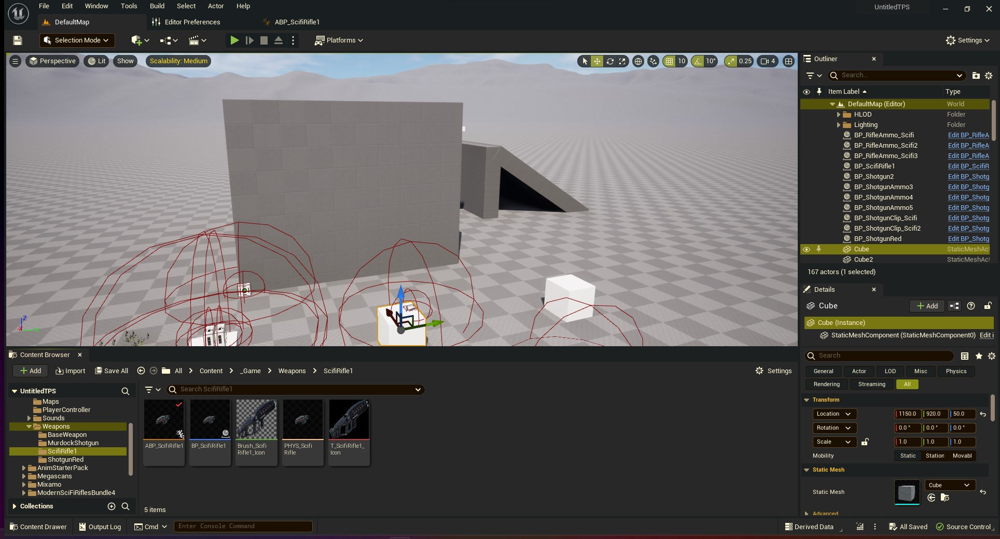
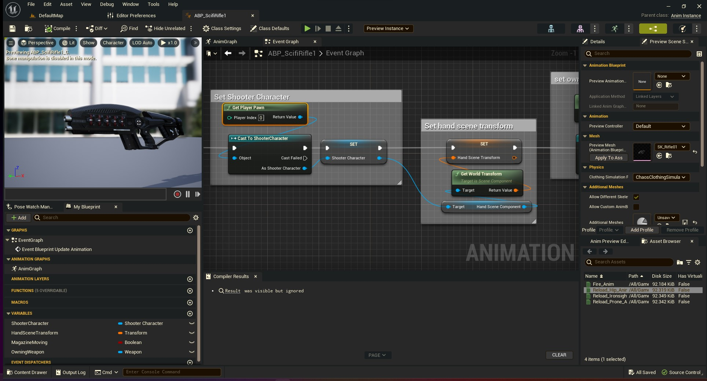

# Gruvbox Theme for Unreal Engine

I've re-created the gruvbox theme for the Unreal Engine. The colors are from https://github.com/morhetz/gruvbox. Feel free to offer suggestions.

Install instructions:
1. Install Gruvbox-UnrealEngine.json file, or clone the repo.
1. Navigate to your Unreal Engine 5 installation folder.
1. Navigate to Engine/Content/Slate/Themes. (Create this directory if you don't have it.)
1. Copy the Gruvbox-UnrealEngine.json file to the Themes folder.
1. Open the editor preferences window under Edit > Editor Preferences.
1. Under the Active Theme dropdown, select gruvbox.
   
Viewport                   |  Blueprints
:-------------------------:|:-------------------------:
 | 
